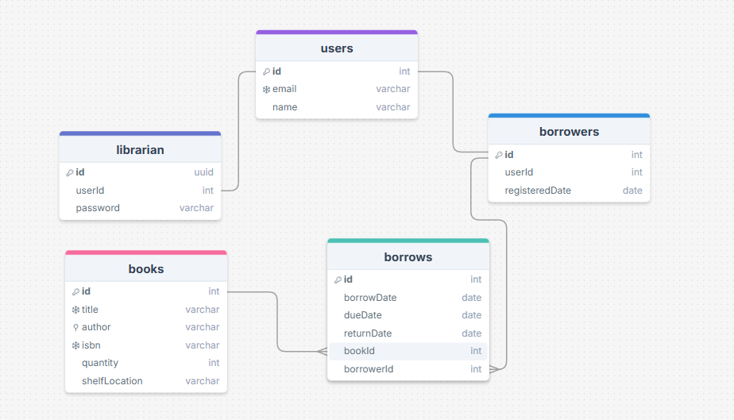

# Library API
This Library Management System allows librarians to manage books, borrowers, and borrowing activities and generate reports. Authentication is implemented only for librarians, who are responsible for administering the system.

Borrowers do not authenticate themselves; instead, their accounts and activities are fully managed by the librarian.

## Features

- CRUD Operations for Books, Borrowers.
- Borrowing System

  - Check out books
  - return a book
  - filter and search borrows and filter borrows by it's due dates, if it returned or not, borrows in period of time and returned in period of time
  - A borrower can check the books they currently have.

- Search & Filtering

  - filter and search books by title, author, ISBN, availability with pagination

- Reports
  - Generate reports on library activities, such as :
    - borrows records within a specific time period
    - Overdue borrows from the previous month
    - All borrow transactions from the previous month
  - Reports are exported in CSV format and saved automatically in the **`exports/`** folder at the root directory upon calling the respective API endpoints.
- pagination
  - Paginated results for books, borrowers and borrows
- Rate Limiting
  - add rate limit for borrows-by-period endpoint and for list all borrowers
- Caching
  - Redis caching for book, borrowers listings ans search queries
  - Automatic cache invalidation on data changes
- Dockerization
  - run the whole app using `docker-compose up --build`.
- Basic Authentication
  - Secure endpoints with username/password authentication (for librarians)
- Unit Testing
  - add unit tests for books service

## Technologies Used

- **Node.js**
- **Express.js**
- **MySQL (Sequelize ORM)**
- **Redis**
- **Docker**

## API Documentation

Full API documentation is available and published via Postman:

[View Library API Docs on Postman](https://documenter.getpostman.com/view/24318609/2sB3BAMCrZ)

- Includes detailed endpoint descriptions, request/response examples, status codes, and error messages.

> **Note:**  
> A default librarian (admin) account is created and seeded automatically for testing purposes.  
> **Email:** `admin@example.com`  
> **Password:** `secret123`  
> You can use these credentials to access secured endpoints right away.

## Database Documentation

The Library API uses a relational database (MySQL) with the following main tables:

### Tables & Indexes

#### `books`

- `id` (PK)
- `title` (unique)
- `author` (indexed)
- `isbn` (unique)
- `quantity`
- `shelfLocation`

#### `users`

- `id` (PK)
- `name`
- `email` (unique)

#### `borrowers`

- `id` (PK)
- `userId` (FK refrence user id in users table)
- `registeredDate`

#### `librarin`

- `id` (PK)
- `userId` (FK refrence user id in users table)
- `password`

#### `borrows`

- `id` (PK)
- `borrowDate`
- `dueDate`
- `returnDate`
- `bookId` (FK refrence book id in books table)
- `borrowerId` (FK refrence borrower id in borrowers table)
- **Unique index:** (`bookId`, `borrowerId`)

### Indexes

Since we frequently search for books by title, ISBN, and author, it's important to optimize these queries with indexes. Both title and ISBN already have unique indexes, so we should add an index on the author field to improve search performance.

- `books.author` – BTREE index

### ER Diagram

> _You can view the database structure in the ER diagram below:_

> view it online: [DB Model](https://drawsql.app/teams/raslan-2/diagrams/library-management-system) .

> 

## Setup Instructions

### Running Locally

### Prerequisites

- **Node.js**
- **MySQL** (running and accessible)
- **Redis** (running and accessible)

1. Clone the repository:

   ```sh
   git clone https://github.com/ahmedraslan28/Bosta-Backend-Engineer-Assessment.git
   cd Bosta-Backend-Engineer-Assessment
   ```

2. Install dependencies:

   ```sh
   npm install
   ```

3. Configure environment variables (.env file):

```sh
PORT= your port
DB_NAME=you db name
DB_USER=your db user
DB_PASS=you db password
DB_HOST=localhost
DB_PORT=your db port

REDIS_HOST=localhost
REDIS_PORT=your redis port
```

4. create database

```sh
Make sure your MySQL server is running and the database exists.
```

5. start the server

```sh
npm run dev
```

6. access the app

- app will be on: http://localhost:{your port}

### Running Using Docker

1. Docker should be installed on your machine:
2. Clone the repository:
   ```sh
   git clone https://github.com/ahmedraslan28/Bosta-Backend-Engineer-Assessment.git
   cd Bosta-Backend-Engineer-Assessment
   ```
3. Run commands:
   ```sh
   docker-compose up --build
   ```
4. access the app

- app will be on: http://localhost:3000

> **Note:**  
> make sure those ports are free [3308,6379,3000] or change them at docker compose before run the containers

## How to Run Tests

1. Make sure you have installed all dependencies:

   ```sh
   npm install
   ```

2. Run tests:
   ```sh
   npm test
   ```
   > **Note:**  
   > Tests can only be run locally (not inside Docker containers).

## For Testers

When you running the app you can use the following user to authenticate:

| Email             | Password  |
| ----------------- | --------- |
| admin@example.com | secret123 |

 